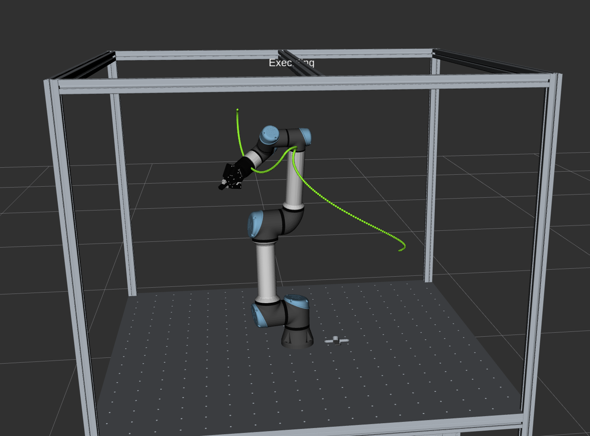
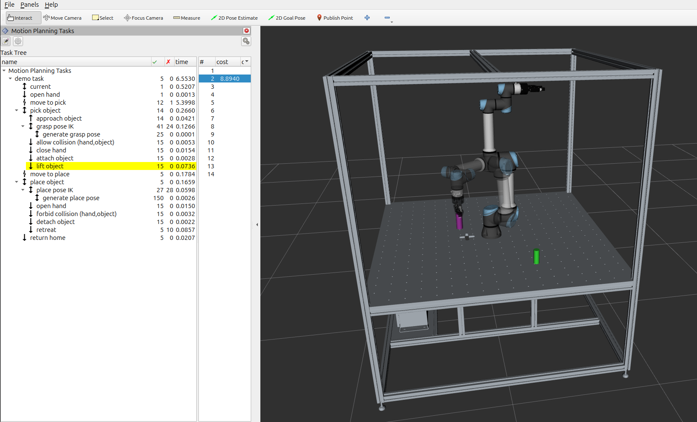

# Moveit Visual Tools
Start Robot Driver:
```bash
ros2 launch robot_table_control start_robot.launch.py use_mock_hardware:=true launch_rviz:=false
```

Start Moveit Movegroup:
```bash
ros2 launch robot_table_moveit_config move_group.launch.py
```

Start Rviz:
```bash
rviz2
```

Start Hello Moveit Tutorial:
```bash
ros2 run hello_moveit hello_moveit
```

Result (Possibility to visualize the planned Path of the Robots eef): 


# Moveit Task Constructor

Start the Robot Driver:
```bash
ros2 launch robot_table_control start_robot.launch.py use_mock_hardware:=true launch_rviz:=false
```

Start the Pick and Place Demo:
```bash
ros2 launch mtc_tutorial pick_place_demo.launch.py 
```

